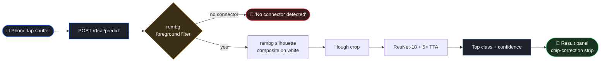

<div align="center">


# Connector ID

**Identify RF coaxial connectors from your phone camera.**
SMA · 3.5mm · 2.92mm · 2.4mm · 1.85mm · male & female.

Powered by [aired.com](https://aired.com)

</div>

---

## What this is

A two-part system that turns a phone photo of an RF coaxial connector
into a class label in ~250–500 ms:

- **Flutter app** (`flutter/`) — cross-platform iOS + Android camera-first
  identifier. Live preview, single-tap shutter, chip-correction strip
  on the result panel. Deployed to [aired.com](https://aired.com).
- **Training + serving stack** (`training/`) — FastAPI predict service
  fronting a fine-tuned ResNet-18, plus the full training pipeline
  (data ingestion, synthesis, retraining, deploy) on a P40-equipped
  Linux box.

Public live endpoint: `https://aired.com/rfcai/predict`.

---

## Production status

| Metric | v18 (held-out: 8 phone shots) |
|---|---|
| Full class (1-of-6) | **75%** |
| Family (1-of-4) | **75%** |
| Gender (M/F) | **87.5%** |
| False positives on backgrounds | **0%** (rembg fg pre-filter) |

Model: ImageNet-pretrained ResNet-18 + `Linear(512 → 6)` head, 20
epochs on 13,849 samples (~60% synthesis-augmented from 3 source
videos). Five alternative architectures (deeper head, two-head, MLP
head, ResNet-50, Prototypical Networks) all *lost* to v18 on the
held-out — see `training/docs/classifier_journey.md` for the trial
log.

---

## How it works (high level)



For the full inference + training flow, see
**[`training/docs/architecture.md`](training/docs/architecture.md)**.

---

## Repository layout

```
.
├── flutter/                 — iOS + Android Flutter app
│   ├── lib/src/screens/     — Identify · Contribute · About
│   ├── tool/generate_icon.py
│   └── README.md            — Flutter-side guide
│
├── training/                — FastAPI service + training pipeline
│   ├── rfconnectorai/       — Python package (model, data, server)
│   ├── scripts/             — training + ops scripts
│   ├── docs/                — architecture, runbook, experiment log
│   ├── tests/               — pytest suite
│   └── README.md            — training-side guide
│
├── docs/                    — cross-cutting docs (handoffs, plans)
│
└── unity/                   — sidelined Unity AR app (kept for history)
```

---

## Quick start

### Run the Flutter app

```bash
cd flutter
flutter pub get
flutter run                  # picks up an attached device or simulator
```

End users see two tabs: **Identify** (camera + predict) and **About**
(version, request-a-connector form, privacy, aired.com link). Tap
the version line on About 7 times to unlock dev mode — that reveals
the **Contribute** tab and the Advanced settings (relay URL, device
token, labeler creds) for owner-side data collection.

See [`flutter/README.md`](flutter/README.md) for build, signing,
icon regeneration, and the deeper backend coupling.

### Run the training pipeline

```bash
cd training
python -m venv .venv
.venv/Scripts/pip install -e ".[dev]"      # Windows
.venv/bin/pip install -e ".[dev]"          # macOS / Linux
```

Then either spin up the FastAPI service locally:

```bash
uvicorn rfconnectorai.server.predict_service:app --port 8503
```

…or run a fine-tune on the labeled dataset:

```bash
python -m rfconnectorai.classifier.train \
    --data-dir data/labeled/embedder \
    --out-dir models/connector_classifier \
    --epochs 20
```

See [`training/README.md`](training/README.md) for the full pipeline,
synth generation, the Streamlit demo + management UI, and the test
suite.

---

## Documentation

| Doc | What's in it |
|---|---|
| [`training/docs/architecture.md`](training/docs/architecture.md) | Mermaid diagrams of the v18 inference + training flows, hyperparam table, why every other architecture lost |
| [`training/docs/classifier_journey.md`](training/docs/classifier_journey.md) | Full experiment log: data findings, every architecture trial, the synth breakthrough |
| [`training/docs/runbook.md`](training/docs/runbook.md) | Deploy, retrain, env knobs, GPU state on the box, smoke-test |
| [`training/docs/capture_protocol.md`](training/docs/capture_protocol.md) | Recommended capture setup for new training videos |
| [`flutter/README.md`](flutter/README.md) | App architecture, dev-mode unlock, icon regeneration, backend coupling |
| [`training/README.md`](training/README.md) | Training pipeline + serving stack overview |

---

## How to grow the dataset

The held-out test set is currently 8 phone shots — too few to
distinguish a real architecture win from single-trial noise (one
prediction = 12.5 percentage points). The next-biggest accuracy
unlock is more diverse phone-shot data, not architecture changes.

In the Flutter app's Contribute tab (dev mode), the top-right
`training` / `HOLDOUT` toggle routes captures to either:

- `data/labeled/embedder/<class>/` — used to train the model
- `data/test_holdout/<class>/` — never used for training, only
  for the post-retrain evaluation

Aim for ~30+ varied holdout shots across all classes (different
lighting, backgrounds, angles) to make experiment results
meaningful.

---

## Tech stack

- **App**: Flutter / Dart 3.7+, `camera`, `image_picker`,
  `shared_preferences`, `package_info_plus`, `url_launcher`
- **Server**: FastAPI, PyTorch 2.5 + cu121, torchvision, OpenCV,
  rembg (U²-Net via ONNX Runtime), pyrender, numpy, Pillow
- **Hardware**: Production runs on a Linux box with 2× Tesla P40
  (24 GB each) — see runbook for the GPU enablement story
- **Deployment**: systemd services + nginx + reverse SSH tunnels
  to expose the predict service publicly via `aired.com/rfcai/*`

---

<div align="center">

**Built and operated by [aired.com](https://aired.com)**

</div>
