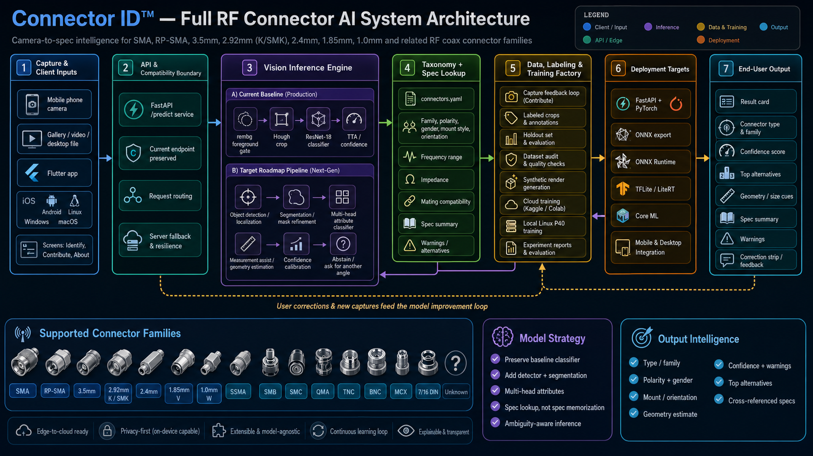
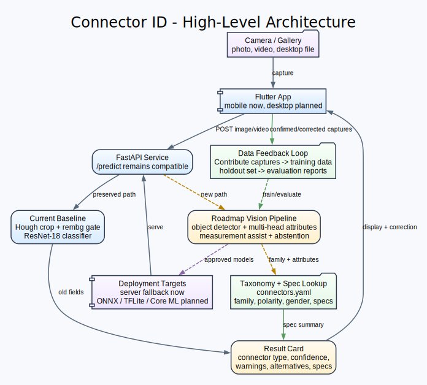

<div align="center">


# Connector ID

**RF connector identification from a phone or desktop camera.**

SMA, RP-SMA, 3.5mm, 2.92mm/K/SMK, 2.4mm, 1.85mm, 1.0mm, SSMA, SMB,
SMC, QMA, TNC, BNC, MCX, 7/16 DIN, and unknown/unsupported.

Powered by [aired.com](https://aired.com)

</div>



---

## What This Is

Connector ID is evolving from a proof-of-concept RF connector classifier
into a production-grade identification system for RF coaxial connectors.
The goal is simple for the end user: point a camera at a connector and get
a correct, useful result.

The target result is not just one flat class label. The system should infer:

- connector family/type,
- standard vs reverse polarity,
- gender/contact configuration,
- mount style,
- orientation,
- cable termination where visible,
- size/geometry cues when a scale reference is available,
- confidence, ambiguity, and top alternatives,
- cross-referenced engineering specs.

The authoritative roadmap is:

- [`IMPLEMENTATION_PLAN.md`](IMPLEMENTATION_PLAN.md)
- [`TASKS.md`](TASKS.md)

The first implementation batch completed the repo audit and taxonomy/spec
foundation:

- [`docs/REPO_AUDIT.md`](docs/REPO_AUDIT.md)
- [`docs/CONNECTOR_TAXONOMY.md`](docs/CONNECTOR_TAXONOMY.md)
- [`training/rfconnectorai/specs/connectors.yaml`](training/rfconnectorai/specs/connectors.yaml)
- [`training/rfconnectorai/schemas/taxonomy.py`](training/rfconnectorai/schemas/taxonomy.py)

---

## Current Implementation Status

- Batches 1-10 scaffolded on `master`: taxonomy, annotation protocol,
  acceptance gates, instance schema, model registry, dataset audit,
  crop manifest, YOLO dataset builder, detector training scaffold,
  multi-head classifier scaffold, prediction response schema, evaluation
  harness, synthetic render planner, mobile/server export scaffold, and
  the demo package.
- Heavy training and rendering run in Kaggle/Colab/cloud — not on the
  local PC. Local invocation is restricted to `--dry-run`.
- Existing `/predict` compatibility is a hard constraint.
- Next: real cloud runs against the YOLO data builder + multihead
  trainer + eval harness, with results posted back into
  `reports/experiments/<run>/`.

Execution gates:
[`docs/ACCEPTANCE_GATES.md`](docs/ACCEPTANCE_GATES.md).
Labeling rulebook:
[`docs/ANNOTATION_PROTOCOL.md`](docs/ANNOTATION_PROTOCOL.md).
Client demo entry:
[`docs/CLIENT_DEMO_README.md`](docs/CLIENT_DEMO_README.md).

---

## Current Baseline

Current production behavior is preserved.

- Flutter app in `flutter/`
- FastAPI predict service in `training/rfconnectorai/server/predict_service.py`
- Existing `/predict` endpoint shape remains:

```json
{
  "image_width": 1920,
  "image_height": 1080,
  "predictions": [
    {
      "class_name": "2.4mm-M",
      "confidence": 0.83,
      "probabilities": {},
      "bbox": {"x": 612, "y": 415, "w": 240, "h": 240}
    }
  ]
}
```

Current documented model:

| Metric | v18 Baseline |
|---|---:|
| Full class accuracy | 75% |
| Family accuracy | 75% |
| Gender accuracy | 87.5% |
| Background false positives | 0% |
| Held-out size | 8 phone shots |

The current model is an ImageNet-pretrained ResNet-18 with a linear head.
The 8-image holdout is too small to support strong accuracy claims; one
miss changes accuracy by 12.5 percentage points.

ResNet-18 is now treated as the baseline and fallback, not the final
architecture. The model strategy is moving to a multi-architecture pipeline:
detector plus multi-head classifier plus geometry/spec verification. See
[`docs/MULTI_ARCHITECTURE_TRANSITION.md`](docs/MULTI_ARCHITECTURE_TRANSITION.md).

---

## Target Architecture

The planned production architecture is a staged computer vision pipeline:

```text
Camera frame
  -> connector/background detector
  -> connector crop or mask
  -> multi-head attribute classifier
  -> optional measurement/calibration module
  -> confidence and ambiguity logic
  -> connector spec lookup
  -> mobile/desktop result card
```



README diagram source:

- [`docs/README_ARCHITECTURE.dot`](docs/README_ARCHITECTURE.dot)
- [`docs/README_ARCHITECTURE.svg`](docs/README_ARCHITECTURE.svg)
- [`docs/README_ARCHITECTURE.png`](docs/README_ARCHITECTURE.png)

Detailed software architecture diagram:

- [`docs/SYSTEM_ARCHITECTURE_POSTER.dot`](docs/SYSTEM_ARCHITECTURE_POSTER.dot)
- [`docs/SYSTEM_ARCHITECTURE_POSTER.svg`](docs/SYSTEM_ARCHITECTURE_POSTER.svg)
- [`docs/SYSTEM_ARCHITECTURE_POSTER_600dpi.png`](docs/SYSTEM_ARCHITECTURE_POSTER_600dpi.png)
- [`docs/SOFTWARE_ARCHITECTURE.dot`](docs/SOFTWARE_ARCHITECTURE.dot)
- [`docs/SOFTWARE_ARCHITECTURE.svg`](docs/SOFTWARE_ARCHITECTURE.svg)
- [`docs/SOFTWARE_ARCHITECTURE.png`](docs/SOFTWARE_ARCHITECTURE.png)

ResNet-to-multi-architecture transition diagram:

- [`docs/MULTI_ARCHITECTURE_TRANSITION.md`](docs/MULTI_ARCHITECTURE_TRANSITION.md)
- [`docs/MULTI_ARCHITECTURE_TRANSITION.dot`](docs/MULTI_ARCHITECTURE_TRANSITION.dot)
- [`docs/MULTI_ARCHITECTURE_TRANSITION.svg`](docs/MULTI_ARCHITECTURE_TRANSITION.svg)
- [`docs/MULTI_ARCHITECTURE_TRANSITION.png`](docs/MULTI_ARCHITECTURE_TRANSITION.png)

See [`docs/DIAGRAM_RENDERING.md`](docs/DIAGRAM_RENDERING.md) to regenerate
Graphviz `.svg` / `.png` assets from the committed `.dot` sources.

The full architecture notes remain in:

- [`training/docs/architecture.md`](training/docs/architecture.md)

---

## Repository Layout

```text
.
|-- IMPLEMENTATION_PLAN.md          authoritative product/architecture roadmap
|-- TASKS.md                        implementation backlog by epic
|-- README.md                       repo overview
|-- docs/
|   |-- REPO_AUDIT.md               current repo and safety baseline
|   |-- CONNECTOR_TAXONOMY.md       connector families and attribute heads
|   |-- MODEL_TRAINING_PIPELINE_SPEC.md
|   |-- MULTI_ARCHITECTURE_TRANSITION.md
|   |-- *_ARCHITECTURE*.dot/svg/png Graphviz sources and rendered diagrams
|   |-- printables/                 ArUco marker assets
|   |-- procurement/                sourcing notes
|   `-- superpowers/                historical plans/specs
|-- flutter/
|   |-- lib/src/api.dart            current /predict client parser
|   |-- lib/src/screens/            Identify, Contribute, About
|   |-- test/                       Flutter tests
|   `-- README.md                   Flutter app guide
|-- training/
|   |-- rfconnectorai/
|   |   |-- classifier/             current ResNet baseline path; future multi-head classifier
|   |   |-- data/                   dataset helpers
|   |   |-- data_fetch/             image/video data collection helpers
|   |   |-- export/                 model export helpers
|   |   |-- inference/              evaluation/reference helpers
|   |   |-- ingest/                 upload ingestion helpers
|   |   |-- measurement/            geometry/ArUco/hex/aperture tools
|   |   |-- models/                 model definitions
|   |   |-- schemas/                taxonomy and future prediction schemas
|   |   |-- server/                 FastAPI predict and relay services
|   |   |-- specs/                  connector spec YAML
|   |   |-- synthetic/              procedural/3D/synthetic data generation
|   |   `-- training/               training utilities/losses
|   |-- configs/                    legacy/current class and dimension configs
|   |-- data/                       current local/reference/holdout data roots
|   |-- docs/                       training architecture/runbook/history
|   |-- scripts/                    training, ingestion, label, and ops scripts
|   |-- tests/                      pytest suite
|   `-- README.md                   training-side guide
`-- unity/                          historical Unity AR app
```

Planned/generated paths from later task batches:

```text
training/rfconnectorai/data/audit.py
training/rfconnectorai/data/build_yolo_dataset.py
training/rfconnectorai/detector/train_yolo.py
training/rfconnectorai/classifier/model_multihead.py
training/rfconnectorai/classifier/train_multihead.py
training/rfconnectorai/eval/evaluate_all.py
training/rfconnectorai/schemas/prediction.py
datasets/rfconnectors/
reports/experiments/
exports/mobile/
```

---

## Quick Start

### Training Package Setup

Use Python 3.11 or newer.

```bash
cd training
python -m venv .venv
.venv/Scripts/pip install -e ".[dev]"      # Windows
.venv/bin/pip install -e ".[dev]"          # macOS/Linux
```

Run the current FastAPI predict service:

```bash
cd training
uvicorn rfconnectorai.server.predict_service:app --port 8503
```

Train the current ResNet baseline only when reproducing the current model:

```bash
cd training
python -m rfconnectorai.classifier.train \
  --data-dir data/labeled/embedder \
  --out-dir models/connector_classifier \
  --epochs 20
```

Future detector and multi-head training should be run in Kaggle, Colab, or
another cloud runtime after scripts are pushed to GitHub. This local PC is
not the target for heavy model bake-offs.

### Flutter App

```bash
cd flutter
flutter pub get
flutter run
```

The app currently provides:

- Identify: camera/photo/video prediction flow.
- About: product info, privacy, request form, dev-mode unlock.
- Contribute: dev-only training and holdout capture flow.

### Diagram Rendering

Graphviz sources are committed so diagrams can be regenerated. See
[`docs/DIAGRAM_RENDERING.md`](docs/DIAGRAM_RENDERING.md) for the full set
of `dot` commands.

---

## Development Rules

- Do not rewrite the whole app.
- Preserve existing `/predict` behavior and Flutter screens.
- Add new structured output beside old fields, not instead of them.
- Keep spec lookup separate from model inference.
- Treat `unknown`, `unsupported`, and `need another angle` as valid outcomes.
- Treat ResNet-18 as the baseline/fallback, not the final architecture.
- Compare detector/classifier candidates in cloud runs before promoting them.
- Do not claim 99.99% accuracy without statistically meaningful validation.
- Every model improvement must include test data discipline, metrics, and
  visible failure cases.

---

## Documentation Index

| Doc | Purpose |
|---|---|
| [`IMPLEMENTATION_PLAN.md`](IMPLEMENTATION_PLAN.md) | Product mission, architecture, accuracy gates, dataset/training/app/API plan |
| [`TASKS.md`](TASKS.md) | Epic-by-epic backlog and execution batches |
| [`docs/REPO_AUDIT.md`](docs/REPO_AUDIT.md) | Current repository audit and safety baseline |
| [`docs/CONNECTOR_TAXONOMY.md`](docs/CONNECTOR_TAXONOMY.md) | Connector family taxonomy and attribute labels |
| [`docs/ANNOTATION_PROTOCOL.md`](docs/ANNOTATION_PROTOCOL.md) | Human-labeling rulebook for instance manifest entries |
| [`docs/ACCEPTANCE_GATES.md`](docs/ACCEPTANCE_GATES.md) | Per-batch acceptance gates (G0-G5) for execution checkpoints |
| [`docs/DIAGRAM_RENDERING.md`](docs/DIAGRAM_RENDERING.md) | Commands to regenerate Graphviz diagrams from `.dot` sources |
| [`docs/MODEL_TRAINING_PIPELINE_SPEC.md`](docs/MODEL_TRAINING_PIPELINE_SPEC.md) | Detailed training pipeline spec for crops, labels, 3D models, synthetic renders, and verification |
| [`docs/MULTI_ARCHITECTURE_TRANSITION.md`](docs/MULTI_ARCHITECTURE_TRANSITION.md) | Plan for evolving from ResNet-only classification to detector plus multi-head model architecture |
| [`training/rfconnectorai/schemas/instance.py`](training/rfconnectorai/schemas/instance.py) | Instance manifest schema (`ConnectorInstance`, `ConnectorSide`, `GeometryLabel`, `LabelConfidence`, `SourceType`) |
| [`training/rfconnectorai/schemas/prediction.py`](training/rfconnectorai/schemas/prediction.py) | API response schema (`PredictResponse`, `Detection`, fixture builders) |
| [`training/rfconnectorai/models/registry.py`](training/rfconnectorai/models/registry.py) | Model record/version registry (`ModelRecord`) for trained artifacts |
| [`docs/CLIENT_DEMO_README.md`](docs/CLIENT_DEMO_README.md) | Entry point for running the client-facing demo |
| [`docs/DEMO_SCRIPT.md`](docs/DEMO_SCRIPT.md) | 5-10 minute walk-through script for the demo |
| [`docs/LIMITATIONS_AND_NEXT_STEPS.md`](docs/LIMITATIONS_AND_NEXT_STEPS.md) | Honest limitations and roadmap |
| [`docs/MODEL_CARD_TEMPLATE.md`](docs/MODEL_CARD_TEMPLATE.md) | Template for promoted detector / classifier / multihead model cards |
| [`exports/mobile/README.md`](exports/mobile/README.md) | Mobile/server export layout and compatibility notes |
| [`docs/README_TECHNICAL_OVERVIEW.dot`](docs/README_TECHNICAL_OVERVIEW.dot) | High-level technical marketing Graphviz source embedded at the top of this README |
| [`docs/SYSTEM_ARCHITECTURE_POSTER.dot`](docs/SYSTEM_ARCHITECTURE_POSTER.dot) | Poster-style full system architecture Graphviz source |
| [`docs/README_ARCHITECTURE.dot`](docs/README_ARCHITECTURE.dot) | Compact Graphviz source for the README architecture diagram |
| [`docs/SOFTWARE_ARCHITECTURE.dot`](docs/SOFTWARE_ARCHITECTURE.dot) | Graphviz source for the full I/O architecture diagram |
| [`docs/Readme_System_Architecture.png`](docs/Readme_System_Architecture.png) | Current top-of-README system architecture image |
| [`training/docs/architecture.md`](training/docs/architecture.md) | Current v18 architecture plus roadmap architecture |
| [`training/docs/classifier_journey.md`](training/docs/classifier_journey.md) | Experiment history and lessons learned |
| [`training/docs/runbook.md`](training/docs/runbook.md) | Deploy/retrain operations |
| [`training/docs/capture_protocol.md`](training/docs/capture_protocol.md) | Capture protocol for new connector data |
| [`flutter/README.md`](flutter/README.md) | Flutter app behavior, backend coupling, and build notes |
| [`training/README.md`](training/README.md) | Training and serving stack guide |

---

<div align="center">

**Built and operated by [aired.com](https://aired.com)**

</div>
