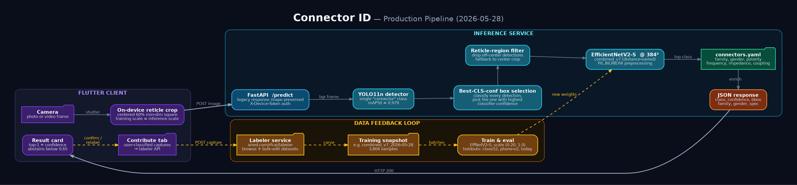

<div align="center">


# Connector ID

**RF connector identification from a phone or desktop camera.**

Distinguishes ten classes — SMA, 3.5mm, 2.92mm/K, 2.4mm, 1.85mm — each in male and female.

Powered by [aired.com](https://aired.com)

</div>



---

## Production Status (2026-05-28)

**Live model:** `combined_v7` — distance-varied EfficientNetV2-S + YOLO11n detector, single classifier (no ensemble), reticle-region box filter on.

| Benchmark | Result |
|---|---|
| **307 real-world phone uploads (all 10 classes)** | **304 / 304 = 100% correct, 3 abstain (99% coverage)** — zero confidently-wrong |
| 48-img phone-realistic v2 holdout | 45 / 45 = 100% correct, 3 abstain — zero confidently-wrong |
| 52-img close-up bench holdout | 45 / 48 = 93.8% (3 confidently-wrong — small close-up regression vs prior prod) |
| Inference latency, CPU | ~310–400 ms / image |

"Confidently wrong" = a wrong prediction emitted at confidence ≥ 0.65 (the app's display threshold). On the realistic phone-usage distribution, the model emits a correct top-1 *every time it emits at all* — when it's unsure, it abstains, and the UX surfaces "no result, try again" instead of a confident-but-wrong class.

Try it: download the Android APK from `https://aired.com/app.apk?v=5`. iOS build requires Xcode + a signing identity (see [`flutter/ios/README.md`](flutter/ios/README.md)).

---

## The Challenge

RF coaxial connectors are visually subtle and physically tiny. Several of the ten classes differ only by **1.4× in diameter** (e.g., 3.5mm vs 2.92mm). Once the detector crops to a tight bounding box, the absolute-scale reference is gone — the classifier has to discriminate from texture, thread pitch, and dielectric proportions alone.

The hard cases were never the bench shots. A 2-way ensemble + best-CLS-conf-box-selection held the bench holdout at 94% Full accuracy for weeks. The problem only surfaced when the same model was tested at **realistic phone-holding distance**:

| Production model | Bench holdout | User's phone test (realistic distance) |
|---|---|---|
| v18 (legacy ResNet-18 + Hough) | 39.5% Full | not measured |
| Jerry's pretrained YOLO+EffNet | 81.4% Full | not measured |
| 2-way ensemble (combined_v2 + jerry_full_nobal) | 88.4% Full | not measured |
| + best-CLS-conf box selection | 90.7% Full / 100% Gender | not measured |
| **Prior production (combined_v3 ensemble)** | **94.2% Full / 100% Gender** | **17% on 3.5mm-M (4 of 24), 44% on 3.5mm-F (8 of 18)** — *confidently wrong* at conf 0.6–0.9 |

The 94% bench number was honest but irrelevant. At realistic phone-holding distance the connector is small in the frame, the detector crops a tight low-pixel region, and the classifier — never having seen that input distribution — would confidently misclassify because its training set was 95% close-up bench shots and the rest were digitally-zoomed close-ups in disguise.

**Three inference-time interventions were tried and failed to close the gap:**
- Image-level ensemble disagreement abstention — catches uncorrelated errors, but the two ensemble members were *correlated-wrong* on the realistic shots
- Reticle-region box filter — helped marginally
- Test-time augmentation with rotation/flip — +5 pts on a single model, 0 pts on top of the ensemble

The fix was **data, not tricks**: a 2026-05-28 capture session added ~263 training shots with real physical-distance variation across all ten classes. Same training recipe, same architecture, same wider-scale augmentation as the prior failed attempt — but with the new data, the model jumped from 44% coverage zero-CW to 99% coverage zero-CW on real phone uploads.

The lesson, persisted across the project memory: **digital zoom is not a substitute for physical distance**. Digitally-zoomed pixels are interpolated upscales of the original sensor patch; they don't reproduce the sharpness, noise, perspective, or depth-of-field of a genuinely-distant capture. A classifier trained on the former cannot generalize to the latter. The investigation lives in [`docs/capture_protocol_distance_2026-05-28.md`](docs/capture_protocol_distance_2026-05-28.md).

The remaining open problem is the small close-up regression (3 confidently-wrong on the 52-img bench holdout vs. 0 for the prior ensemble). A conservative alternative — `v7 + jerry_full_nobal + reticle + threshold 0.85` — is zero-CW everywhere but trades coverage. The high-coverage config is shipping because the realistic-distance distribution matches real users.

---

## How it works

```text
Camera frame
  → YOLO11n detector (single-class "connector")
  → tight bounding-box crop (best-CLS-confidence box, not best-YOLO box)
  → EfficientNetV2-S classifier @ 384²
  → softmax + family / gender decomposition
  → spec lookup from training/rfconnectorai/specs/connectors.yaml
  → JSON response with class, confidence, bbox, family, gender, spec
```

The Flutter app presents a centered reticle on the live camera preview; users fit the connector inside it and tap shutter. The app crops a centered 60%-of-min-dim square on-device before upload, so training and inference share scale. The server runs the detector, picks the best-classifier-confidence box (which empirically beats best-YOLO-score box selection by ~3pts), classifies, and returns structured output.

Two pieces matter for the production behavior beyond the model itself:
- **`RFCAI_BEST_CLS_CONF_BOX=1`** — re-rank detected boxes by the classifier's top-1 confidence rather than the detector's score. Catches cases where YOLO finds a connector-shaped region that's actually a background patch.
- **`RFCAI_RETICLE_REGION_FILTER=1`** — drop YOLO boxes whose center sits outside the central 60%-min-dim square. On already-reticle-cropped phone uploads this is mostly a no-op; on full-frame uploads it filters sloppy edge detections.

Detailed architecture notes: [`training/docs/architecture.md`](training/docs/architecture.md).

---

## Quick Start

```bash
# Server
cd training
python -m venv .venv
.venv/Scripts/pip install -e ".[dev]"        # Windows
.venv/bin/pip install -e ".[dev]"            # macOS/Linux
uvicorn rfconnectorai.server.predict_service:app --port 8503

# Flutter app
cd flutter
flutter pub get
flutter run
```

The Flutter app has three tabs:
- **Identify** — live camera + tap-to-classify, single-shot prediction.
- **Contribute** — sign-in-gated training data capture, auto-uploads to the labeler.
- **About** — product info, on-device toggle, footer.

The predict service expects an `X-Device-Token` header on `/predict`. The labeler at `/rfcai/labeler/` accepts Bearer tokens issued by `/api-tokens/exchange` (`POST username + password`).

---

## Repository Layout

```text
flutter/                    Flutter app (Android + iOS)
training/
  rfconnectorai/
    server/                 FastAPI predict + labeler services
    pipeline/               YOLO + EffNet inference path (jerry_pipeline.py)
    classifier/             legacy ResNet-18 path, kept as fallback
    specs/                  connectors.yaml (taxonomy + spec lookup)
    schemas/                Pydantic schemas for instances + predictions
    measurement/            ArUco / scale-reference helpers (unused in prod)
  scripts/                  training, eval, ingestion, ops scripts
  data/                     train data + holdouts (gitignored)
  docs/                     training-side architecture, runbook, capture protocol
aired_site/                 static HTML for the aired.com landing page
docs/                       project-wide architecture diagrams + capture protocol
unity/                      historical Unity AR app (not used in prod)
```

---

## Documentation

| Doc | Purpose |
|---|---|
| [`docs/capture_protocol_distance_2026-05-28.md`](docs/capture_protocol_distance_2026-05-28.md) | Why distance-varied capture matters; the protocol used to fix the realistic-distance failure mode |
| [`docs/CONNECTOR_TAXONOMY.md`](docs/CONNECTOR_TAXONOMY.md) | Connector family taxonomy and attribute heads |
| [`docs/MODEL_TRAINING_PIPELINE_SPEC.md`](docs/MODEL_TRAINING_PIPELINE_SPEC.md) | Training pipeline spec for crops, labels, synthetic renders, verification |
| [`training/docs/architecture.md`](training/docs/architecture.md) | Inference architecture + roadmap |
| [`training/docs/runbook.md`](training/docs/runbook.md) | Deploy / retrain operations |
| [`training/docs/capture_protocol.md`](training/docs/capture_protocol.md) | General capture protocol (predates the 2026-05-28 distance addendum) |
| [`flutter/README.md`](flutter/README.md) | Flutter app behavior, backend coupling, build notes |
| [`training/README.md`](training/README.md) | Training and serving stack guide |
| [`training/rfconnectorai/specs/connectors.yaml`](training/rfconnectorai/specs/connectors.yaml) | Connector family specs (frequency, impedance, coupling, compatibility) |

The `/predict` API response shape — preserved for backward compatibility with older clients, with the structured fields (`family`, `gender`, `family_confidence`, `gender_confidence`, `spec`) added beside the legacy `class_name`:

```json
{
  "image_width": 1920,
  "image_height": 1080,
  "predictions": [
    {
      "class_name": "2.4mm-M",
      "confidence": 0.83,
      "probabilities": { "2.4mm-M": 0.83, "...": "..." },
      "bbox": {"x": 612, "y": 415, "w": 240, "h": 240},
      "family": "2.4mm",
      "gender": "M",
      "family_confidence": 0.91,
      "gender_confidence": 0.96,
      "spec": { "frequency_ghz_max": 50, "impedance_ohms": 50, "coupling": "threaded" }
    }
  ]
}
```

---

## Acknowledgements

Significant parts of the current pipeline started in the [trextrader/hotdogornot](https://github.com/trextrader/hotdogornot) fork — adopted into this main repo after head-to-head benching ([`training/docs/yolo_hybrid_evaluation_2026-05-11.md`](training/docs/yolo_hybrid_evaluation_2026-05-11.md)):

- **YOLO11n crop detector** (`models/detector/best.pt`, mAP50 ≈ 0.979) — Jerry's training, now the production detector.
- **Connector taxonomy** (`connectors.yaml`, 16 families with spec lookup) — authored in the fork, drives per-prediction `spec` enrichment.
- **YOLO+EffNet inference path** (`pipeline/jerry_pipeline.py`) — Python port of the partner's Capacitor app pipeline; now production via `RFCAI_USE_JERRY_PIPELINE=1`.
- **Typed prediction schemas** — informed the additive structured fields on the legacy response.

The 263 distance-varied training shots that unlocked the 2026-05-28 production win were captured by the project's user against their own connector collection.

<div align="center">

**Built and operated by [aired.com](https://aired.com)**

</div>
