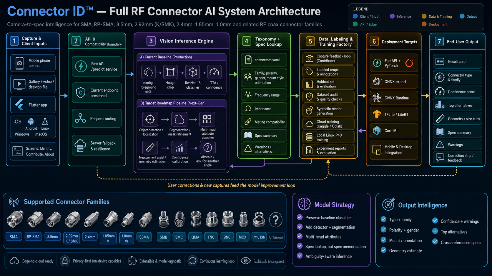
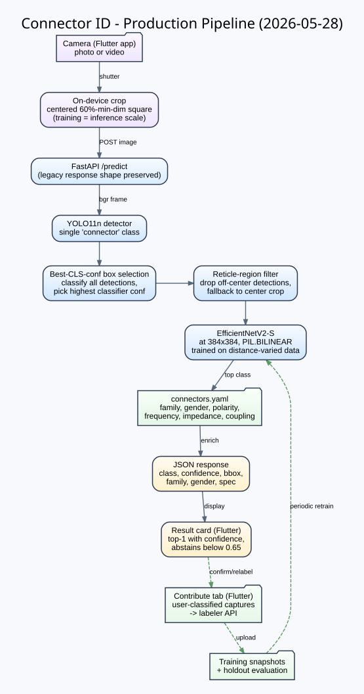

<div align="center">


# Connector ID

**RF connector identification from a phone or desktop camera.**

SMA, RP-SMA, 3.5mm, 2.92mm/K/SMK, 2.4mm, 1.85mm, 1.0mm, SSMA, SMB,
SMC, QMA, TNC, BNC, MCX, 7/16 DIN, and unknown/unsupported.

Powered by [aired.com](https://aired.com)

</div>



---

## Production Status (2026-05-28)

**Live model:** `combined_v7` — distance-varied EfficientNetV2-S + YOLO11n detector, single classifier (no ensemble), reticle-region box filter on.

| Benchmark | Result |
|---|---|
| **307 real-world phone uploads (all 10 classes)** | **304 / 304 = 100% correct, 3 abstain (99% coverage)** — zero confidently-wrong |
| 48-img clean phone-realistic holdout | 45 / 45 = 100% correct, 3 abstain | zero confidently-wrong |
| 52-img close-up bench holdout (regression detector) | 45 / 48 = 93.8% (3 confidently-wrong — small close-up regression) |
| Inference latency, CPU | ~310-400ms/image |

What "confidently wrong" means here: a wrong prediction emitted at confidence ≥ 0.65 (the app's display threshold). On the realistic phone-usage distribution, the production model now emits a correct top-1 *every time it emits at all*. When the model isn't sure, it abstains — UX surfaces "no result, try again" instead of a confident-but-wrong class.

## The Challenge

RF coaxial connectors are visually subtle and physically tiny. The system needs to distinguish ten classes — SMA, 3.5mm, 2.92mm/K, 2.4mm, 1.85mm, each in male and female — and several of them differ only by **1.4× in diameter** (e.g., 3.5mm vs 2.92mm). Once the YOLO detector crops to a tight bounding box, the absolute-scale reference is gone; the classifier has to discriminate from texture, thread pitch, and dielectric proportions alone.

The hard cases were never the bench shots. The bench-photography holdout sat at 94% Full accuracy for weeks with a 2-way ensemble + best-CLS-conf-box selection. The problem only surfaced when the same model was tested at **realistic phone-holding distance**:

| Production model | Bench holdout | User's phone test (realistic distance) |
|---|---|---|
| v18 (legacy ResNet-18 + Hough) | 39.5% Full / 74.4% Gender | not measured |
| Jerry's pretrained YOLO+EffNet | 81.4% Full | not measured |
| 2-way ensemble (combined_v2 + jerry_full_nobal) | 88.4% Full / 95.3% Gender | not measured |
| + best-CLS-conf box selection | 90.7% Full / 100% Gender | not measured |
| **Prior production (combined_v3 ensemble)** | **94.2% Full / 100% Gender** | **17% on 3.5mm-M (4/24), 44% on 3.5mm-F (8/18)** — *confidently wrong* at conf 0.6-0.9 |

The 94% bench number was honest but irrelevant to actual use. At the distance a user naturally holds a phone, the connector is small in the frame, YOLO crops a tight region with low effective pixel-count, and the classifier — never having seen that input distribution — would confidently call a 3.5mm-M a 2.92mm-M because its training set was 95% close-up bench shots and the rest were digitally-zoomed close-ups in disguise.

**Three separate inference-time interventions were tried and failed to close this gap:**
- Image-level ensemble disagreement abstention (catches uncorrelated errors — but the two members of the production ensemble were *correlated-wrong* on the realistic shots)
- Reticle-region box filter (dropped sloppy off-center detections — helped marginally)
- Test-time augmentation with rotation/flip (improved single-model by 5pt — but added zero on top of the ensemble)

The fix turned out to be **data, not tricks**: a 2026-05-28 capture session added ~263 training shots with real physical-distance variation across all ten classes (vs. the prior single-distance + digital-zoom set). Same training recipe, same architecture, same wider-scale augmentation as the prior failed attempt — but with the new data, the model jumped from 44% coverage zero-CW to 99% coverage zero-CW on real phone uploads.

The lesson, persisted across the project memory: **digital zoom is not a substitute for physical distance**. Digitally-zoomed pixels are interpolated upscales of the original sensor patch; they don't reproduce the sharpness, noise, perspective, or depth-of-field of a genuinely-distant capture. A classifier trained on the former cannot generalize to the latter. The full investigation lives in [`docs/capture_protocol_distance_2026-05-28.md`](docs/capture_protocol_distance_2026-05-28.md).

The remaining open problem is a small regression on close-up bench shots (3 confidently-wrong on the 52-img holdout vs. 0 for the prior ensemble). The conservative alternative configuration (`v7 + jerry_full_nobal + reticle + threshold 0.85`) is zero-CW everywhere but trades coverage. We're shipping the high-coverage config because the realistic-distance distribution matches real users.

---

## What This Is

Connector ID is evolving from a proof-of-concept RF connector classifier
into a production-grade identification system for RF coaxial connectors.
The goal is simple for the end user: point a camera at a connector and get
a correct, useful result.

The target result is not just one flat class label. The system should infer:

- connector family/type,
- standard vs reverse polarity,
- gender/contact configuration,
- mount style,
- orientation,
- cable termination where visible,
- size/geometry cues when a scale reference is available,
- confidence, ambiguity, and top alternatives,
- cross-referenced engineering specs.

The authoritative roadmap is:

- [`IMPLEMENTATION_PLAN.md`](IMPLEMENTATION_PLAN.md)
- [`TASKS.md`](TASKS.md)

The first implementation batch completed the repo audit and taxonomy/spec
foundation:

- [`docs/REPO_AUDIT.md`](docs/REPO_AUDIT.md)
- [`docs/CONNECTOR_TAXONOMY.md`](docs/CONNECTOR_TAXONOMY.md)
- [`training/rfconnectorai/specs/connectors.yaml`](training/rfconnectorai/specs/connectors.yaml)
- [`training/rfconnectorai/schemas/taxonomy.py`](training/rfconnectorai/schemas/taxonomy.py)

---

## Current Implementation Status

- Batches 1-10 scaffolded on `master`: taxonomy, annotation protocol,
  acceptance gates, instance schema, model registry, dataset audit,
  crop manifest, YOLO dataset builder, detector training scaffold,
  multi-head classifier scaffold, prediction response schema, evaluation
  harness, synthetic render planner, mobile/server export scaffold, and
  the demo package.
- Heavy training and rendering run in Kaggle/Colab/cloud — not on the
  local PC. Local invocation is restricted to `--dry-run`.
- Existing `/predict` compatibility is a hard constraint.
- Next: real cloud runs against the YOLO data builder + multihead
  trainer + eval harness, with results posted back into
  `reports/experiments/<run>/`.

Execution gates:
[`docs/ACCEPTANCE_GATES.md`](docs/ACCEPTANCE_GATES.md).
Labeling rulebook:
[`docs/ANNOTATION_PROTOCOL.md`](docs/ANNOTATION_PROTOCOL.md).
Client demo entry:
[`docs/CLIENT_DEMO_README.md`](docs/CLIENT_DEMO_README.md).

---

## Current Baseline

Current production behavior is preserved.

- Flutter app in `flutter/`
- FastAPI predict service in `training/rfconnectorai/server/predict_service.py`
- Existing `/predict` endpoint shape remains:

```json
{
  "image_width": 1920,
  "image_height": 1080,
  "predictions": [
    {
      "class_name": "2.4mm-M",
      "confidence": 0.83,
      "probabilities": {},
      "bbox": {"x": 612, "y": 415, "w": 240, "h": 240}
    }
  ]
}
```

Production currently serves **`combined_v7`** — see the "Production Status" table at the top of this README. The numbers below trace the journey from the original baseline.

| Model | Date | Bench accuracy (close-up holdout) | Notes |
|---|---|---|---|
| v18 ResNet-18 + Hough | 2026-05-05 | 39.5% Full | 5-7s/image, single head |
| Jerry's pretrained YOLO+EffNet | 2026-05-18 | 81.4% Full | from `trextrader/hotdogornot` fork |
| combined_v2 + jerry_full_nobal (2-way ensemble) | 2026-05-26 | 88.4% Full / 95.3% Gender | data-source diversity beats seed diversity |
| + best-CLS-conf box selection | 2026-05-26 | 90.7% Full / 100% Gender | re-rank YOLO boxes by classifier confidence |
| **Prior production (combined_v3 ensemble)** | 2026-05-26 | **94.2% Full / 100% Gender** (52-img) | shipped until v7 |
| **Current production (combined_v7 + reticle filter)** | **2026-05-28** | 93.8% Full (52-img bench) — slight regression | **100% on 304/307 real-world phone uploads, zero confidently-wrong at conf >= 0.65** |

The historical bench progress (39.5% -> 94.2%) was real but masked the actual user-facing problem (the model failed at realistic phone-holding distance). See "The Challenge" above for the full story.

The 52-image bench holdout is well-curated but not representative of phone-app inference. The 48-image phone-realistic v2 holdout (`data/test_holdout_phone_2026-05-28/`) and the 307-image full-upload set are the benchmarks v7+ have to clear.

Tracked benchmark reports under
[`training/reports/`](training/reports/). Re-run with
[`training/scripts/eval_holdout.py`](training/scripts/eval_holdout.py)
after any production change — this is the gate that catches silent
regressions (e.g. the labels.json inversion that drifted gender
accuracy from 87.5% to 12.5% for 9 days unnoticed before our
eval-harness discipline started).

Predictions now include structured fields beside the legacy
`class_name`: `family`, `gender`, `family_confidence`,
`gender_confidence`, and a `spec` block from
[`training/rfconnectorai/specs/connectors.yaml`](training/rfconnectorai/specs/connectors.yaml)
(frequency range, impedance, coupling, compatibility). The Flutter
result panel displays the spec on tap. Older clients that only
consume `class_name` still work — the new fields are additive.

The `connectors.yaml` taxonomy (16 families across SMA, RP-SMA, 3.5mm,
2.92mm/K, 2.4mm, 1.85mm, 1.0mm, SSMA, SMB, SMC, QMA, TNC, BNC, MCX,
7/16 DIN, and an unknown bucket) and the typed prediction-schema
direction came from the [trextrader/hotdogornot
fork](https://github.com/trextrader/hotdogornot)'s
multi-architecture rewrite. See
[`training/docs/yolo_hybrid_evaluation_2026-05-11.md`](training/docs/yolo_hybrid_evaluation_2026-05-11.md)
for the three-way bench (production v18 + Hough vs the fork's YOLO
hybrid vs full multi-head) that justified the pieces we kept vs the
pieces we deferred.

### Standalone on-device path (iOS-first, Tier 1)

The Flutter app also bundles the same ResNet-18 ONNX (44 MB) in
`flutter/assets/models/` and can run inference entirely on the
phone via the `onnxruntime` package. Toggle in **About → Advanced
→ "On-device inference"** (dev-mode-gated). No network round-trip,
works offline, ~50–100 ms per inference. Skips rembg + Hough + TTA
in this tier — accuracy may differ from the server path; planned
field test on iPhone determines whether to ship as-is or port the
preprocessing stack too (Tier 2 / Tier 3 in
`training/docs/yolo_hybrid_evaluation_2026-05-11.md`).

ResNet-18 is now treated as the baseline and fallback, not the final
architecture. The model strategy is moving to a multi-architecture pipeline:
detector plus multi-head classifier plus geometry/spec verification. See
[`docs/MULTI_ARCHITECTURE_TRANSITION.md`](docs/MULTI_ARCHITECTURE_TRANSITION.md).

---

## Target Architecture

The planned production architecture is a staged computer vision pipeline:

```text
Camera frame
  -> connector/background detector
  -> connector crop or mask
  -> multi-head attribute classifier
  -> optional measurement/calibration module
  -> confidence and ambiguity logic
  -> connector spec lookup
  -> mobile/desktop result card
```



README diagram source:

- [`docs/README_ARCHITECTURE.dot`](docs/README_ARCHITECTURE.dot)
- [`docs/README_ARCHITECTURE.svg`](docs/README_ARCHITECTURE.svg)
- [`docs/README_ARCHITECTURE.png`](docs/README_ARCHITECTURE.png)

Detailed software architecture diagram:

- [`docs/SYSTEM_ARCHITECTURE_POSTER.dot`](docs/SYSTEM_ARCHITECTURE_POSTER.dot)
- [`docs/SYSTEM_ARCHITECTURE_POSTER.svg`](docs/SYSTEM_ARCHITECTURE_POSTER.svg)
- [`docs/SYSTEM_ARCHITECTURE_POSTER_600dpi.png`](docs/SYSTEM_ARCHITECTURE_POSTER_600dpi.png)
- [`docs/SOFTWARE_ARCHITECTURE.dot`](docs/SOFTWARE_ARCHITECTURE.dot)
- [`docs/SOFTWARE_ARCHITECTURE.svg`](docs/SOFTWARE_ARCHITECTURE.svg)
- [`docs/SOFTWARE_ARCHITECTURE.png`](docs/SOFTWARE_ARCHITECTURE.png)

ResNet-to-multi-architecture transition diagram:

- [`docs/MULTI_ARCHITECTURE_TRANSITION.md`](docs/MULTI_ARCHITECTURE_TRANSITION.md)
- [`docs/MULTI_ARCHITECTURE_TRANSITION.dot`](docs/MULTI_ARCHITECTURE_TRANSITION.dot)
- [`docs/MULTI_ARCHITECTURE_TRANSITION.svg`](docs/MULTI_ARCHITECTURE_TRANSITION.svg)
- [`docs/MULTI_ARCHITECTURE_TRANSITION.png`](docs/MULTI_ARCHITECTURE_TRANSITION.png)

See [`docs/DIAGRAM_RENDERING.md`](docs/DIAGRAM_RENDERING.md) to regenerate
Graphviz `.svg` / `.png` assets from the committed `.dot` sources.

The full architecture notes remain in:

- [`training/docs/architecture.md`](training/docs/architecture.md)

---

## Repository Layout

```text
.
|-- IMPLEMENTATION_PLAN.md          authoritative product/architecture roadmap
|-- TASKS.md                        implementation backlog by epic
|-- README.md                       repo overview
|-- docs/
|   |-- REPO_AUDIT.md               current repo and safety baseline
|   |-- CONNECTOR_TAXONOMY.md       connector families and attribute heads
|   |-- MODEL_TRAINING_PIPELINE_SPEC.md
|   |-- MULTI_ARCHITECTURE_TRANSITION.md
|   |-- *_ARCHITECTURE*.dot/svg/png Graphviz sources and rendered diagrams
|   |-- printables/                 ArUco marker assets
|   |-- procurement/                sourcing notes
|   `-- superpowers/                historical plans/specs
|-- flutter/
|   |-- lib/src/api.dart            current /predict client parser
|   |-- lib/src/screens/            Identify, Contribute, About
|   |-- test/                       Flutter tests
|   `-- README.md                   Flutter app guide
|-- training/
|   |-- rfconnectorai/
|   |   |-- classifier/             current ResNet baseline path; future multi-head classifier
|   |   |-- data/                   dataset helpers
|   |   |-- data_fetch/             image/video data collection helpers
|   |   |-- export/                 model export helpers
|   |   |-- inference/              evaluation/reference helpers
|   |   |-- ingest/                 upload ingestion helpers
|   |   |-- measurement/            geometry/ArUco/hex/aperture tools
|   |   |-- models/                 model definitions
|   |   |-- schemas/                taxonomy and future prediction schemas
|   |   |-- server/                 FastAPI predict and relay services
|   |   |-- specs/                  connector spec YAML
|   |   |-- synthetic/              procedural/3D/synthetic data generation
|   |   `-- training/               training utilities/losses
|   |-- configs/                    legacy/current class and dimension configs
|   |-- data/                       current local/reference/holdout data roots
|   |-- docs/                       training architecture/runbook/history
|   |-- scripts/                    training, ingestion, label, and ops scripts
|   |-- tests/                      pytest suite
|   `-- README.md                   training-side guide
`-- unity/                          historical Unity AR app
```

Planned/generated paths from later task batches:

```text
training/rfconnectorai/data/audit.py
training/rfconnectorai/data/build_yolo_dataset.py
training/rfconnectorai/detector/train_yolo.py
training/rfconnectorai/classifier/model_multihead.py
training/rfconnectorai/classifier/train_multihead.py
training/rfconnectorai/eval/evaluate_all.py
training/rfconnectorai/schemas/prediction.py
datasets/rfconnectors/
reports/experiments/
exports/mobile/
```

---

## Quick Start

### Training Package Setup

Use Python 3.11 or newer.

```bash
cd training
python -m venv .venv
.venv/Scripts/pip install -e ".[dev]"      # Windows
.venv/bin/pip install -e ".[dev]"          # macOS/Linux
```

Run the current FastAPI predict service:

```bash
cd training
uvicorn rfconnectorai.server.predict_service:app --port 8503
```

Train the current ResNet baseline only when reproducing the current model:

```bash
cd training
python -m rfconnectorai.classifier.train \
  --data-dir data/labeled/embedder \
  --out-dir models/connector_classifier \
  --epochs 20
```

Future detector and multi-head training should be run in Kaggle, Colab, or
another cloud runtime after scripts are pushed to GitHub. This local PC is
not the target for heavy model bake-offs.

### Flutter App

```bash
cd flutter
flutter pub get
flutter run
```

The app currently provides:

- Identify: camera/photo/video prediction flow.
- About: product info, privacy, request form, dev-mode unlock.
- Contribute: dev-only training and holdout capture flow.

### Diagram Rendering

Graphviz sources are committed so diagrams can be regenerated. See
[`docs/DIAGRAM_RENDERING.md`](docs/DIAGRAM_RENDERING.md) for the full set
of `dot` commands.

---

## Development Rules

- Do not rewrite the whole app.
- Preserve existing `/predict` behavior and Flutter screens.
- Add new structured output beside old fields, not instead of them.
- Keep spec lookup separate from model inference.
- Treat `unknown`, `unsupported`, and `need another angle` as valid outcomes.
- Treat ResNet-18 as the baseline/fallback, not the final architecture.
- Compare detector/classifier candidates in cloud runs before promoting them.
- Do not claim 99.99% accuracy without statistically meaningful validation.
- Every model improvement must include test data discipline, metrics, and
  visible failure cases.

---

## Documentation Index

| Doc | Purpose |
|---|---|
| [`IMPLEMENTATION_PLAN.md`](IMPLEMENTATION_PLAN.md) | Product mission, architecture, accuracy gates, dataset/training/app/API plan |
| [`TASKS.md`](TASKS.md) | Epic-by-epic backlog and execution batches |
| [`docs/REPO_AUDIT.md`](docs/REPO_AUDIT.md) | Current repository audit and safety baseline |
| [`docs/CONNECTOR_TAXONOMY.md`](docs/CONNECTOR_TAXONOMY.md) | Connector family taxonomy and attribute labels |
| [`docs/ANNOTATION_PROTOCOL.md`](docs/ANNOTATION_PROTOCOL.md) | Human-labeling rulebook for instance manifest entries |
| [`docs/ACCEPTANCE_GATES.md`](docs/ACCEPTANCE_GATES.md) | Per-batch acceptance gates (G0-G5) for execution checkpoints |
| [`docs/DIAGRAM_RENDERING.md`](docs/DIAGRAM_RENDERING.md) | Commands to regenerate Graphviz diagrams from `.dot` sources |
| [`docs/MODEL_TRAINING_PIPELINE_SPEC.md`](docs/MODEL_TRAINING_PIPELINE_SPEC.md) | Detailed training pipeline spec for crops, labels, 3D models, synthetic renders, and verification |
| [`docs/MULTI_ARCHITECTURE_TRANSITION.md`](docs/MULTI_ARCHITECTURE_TRANSITION.md) | Plan for evolving from ResNet-only classification to detector plus multi-head model architecture |
| [`training/rfconnectorai/schemas/instance.py`](training/rfconnectorai/schemas/instance.py) | Instance manifest schema (`ConnectorInstance`, `ConnectorSide`, `GeometryLabel`, `LabelConfidence`, `SourceType`) |
| [`training/rfconnectorai/schemas/prediction.py`](training/rfconnectorai/schemas/prediction.py) | API response schema (`PredictResponse`, `Detection`, fixture builders) |
| [`training/rfconnectorai/models/registry.py`](training/rfconnectorai/models/registry.py) | Model record/version registry (`ModelRecord`) for trained artifacts |
| [`docs/CLIENT_DEMO_README.md`](docs/CLIENT_DEMO_README.md) | Entry point for running the client-facing demo |
| [`docs/DEMO_SCRIPT.md`](docs/DEMO_SCRIPT.md) | 5-10 minute walk-through script for the demo |
| [`docs/LIMITATIONS_AND_NEXT_STEPS.md`](docs/LIMITATIONS_AND_NEXT_STEPS.md) | Honest limitations and roadmap |
| [`docs/MODEL_CARD_TEMPLATE.md`](docs/MODEL_CARD_TEMPLATE.md) | Template for promoted detector / classifier / multihead model cards |
| [`exports/mobile/README.md`](exports/mobile/README.md) | Mobile/server export layout and compatibility notes |
| [`docs/README_TECHNICAL_OVERVIEW.dot`](docs/README_TECHNICAL_OVERVIEW.dot) | High-level technical marketing Graphviz source embedded at the top of this README |
| [`docs/SYSTEM_ARCHITECTURE_POSTER.dot`](docs/SYSTEM_ARCHITECTURE_POSTER.dot) | Poster-style full system architecture Graphviz source |
| [`docs/README_ARCHITECTURE.dot`](docs/README_ARCHITECTURE.dot) | Compact Graphviz source for the README architecture diagram |
| [`docs/SOFTWARE_ARCHITECTURE.dot`](docs/SOFTWARE_ARCHITECTURE.dot) | Graphviz source for the full I/O architecture diagram |
| [`docs/Readme_System_Architecture.png`](docs/Readme_System_Architecture.png) | Current top-of-README system architecture image |
| [`training/docs/architecture.md`](training/docs/architecture.md) | Current v18 architecture plus roadmap architecture |
| [`training/docs/classifier_journey.md`](training/docs/classifier_journey.md) | Experiment history and lessons learned |
| [`training/docs/runbook.md`](training/docs/runbook.md) | Deploy/retrain operations |
| [`training/docs/capture_protocol.md`](training/docs/capture_protocol.md) | Capture protocol for new connector data |
| [`flutter/README.md`](flutter/README.md) | Flutter app behavior, backend coupling, and build notes |
| [`training/README.md`](training/README.md) | Training and serving stack guide |

---

## Acknowledgements

Significant parts of the current production pipeline started in
the [trextrader/hotdogornot](https://github.com/trextrader/hotdogornot)
fork — adopted into this main repo after head-to-head benching
([`training/docs/yolo_hybrid_evaluation_2026-05-11.md`](training/docs/yolo_hybrid_evaluation_2026-05-11.md)).
Specifically:

- **YOLO11n crop detector** (`models/detector/best.pt`, trained to
  mAP50=0.979) — now wired as a fallback when Hough returns no
  crops. Original detector training + weights are Jerry's work in
  the fork.
- **Connector taxonomy** (`training/rfconnectorai/specs/connectors.yaml`,
  16 families with structured spec lookup) — authored in the fork,
  now driving the per-prediction `spec` enrichment in `/predict`.
- **Typed prediction schemas** that motivated the additive
  structured `family` / `gender` / `family_confidence` /
  `gender_confidence` fields on the existing response.
- **Pydantic instance / prediction / taxonomy schemas** — informed
  the labels.json discipline (now enforced by an assertion in
  `train.py`) and the eval-harness pattern.
- **Detect-classify pipeline** (`pipeline/detect_classify.py`) —
  end-to-end YOLO-then-multi-head scaffolding that benched but
  hasn't shipped to production (production still serves the
  ResNet-18 single-head). Code path is intact for when richer
  attribute labels arrive.

What's kept on the main repo: the production ResNet-18 single-head
classifier, rembg foreground gating with `u2netp`, Hough crops, 5×
TTA, all backed by the eval-harness reports under
[`training/reports/`](training/reports/).

<div align="center">

**Built and operated by [aired.com](https://aired.com)**

</div>
