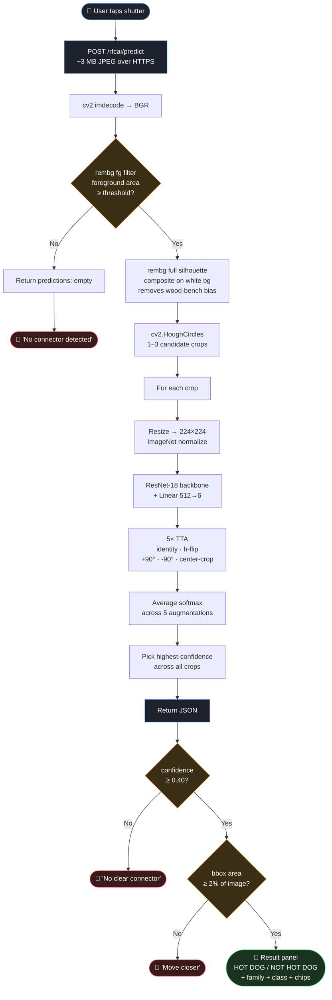
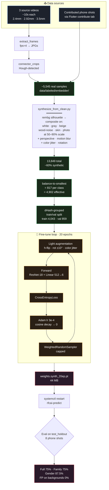
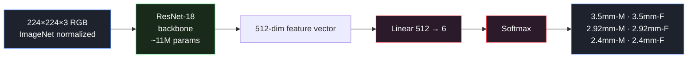

# Architecture — How v18 Works

The deployed model is **v18**: a fine-tuned ResNet-18 with a single
linear classifier head, sandwiched between a rembg foreground filter
(in front, gates predictions) and 5× test-time augmentation (behind,
smooths the output).

This doc visualizes both pipelines. For *why* we ended up here see
`classifier_journey.md`. For deploy/retrain ops see `runbook.md`.

Roadmap note: `../../IMPLEMENTATION_PLAN.md` and `../../TASKS.md` now
define the next architecture direction. The current v18 path remains the
compatibility baseline, but the target system adds detector training,
multi-head attribute classification, structured spec lookup, abstention
states, and mobile/desktop deployment options.

Detailed Graphviz source for the full proposed I/O architecture:

```bash
dot -Tpng ../../docs/SOFTWARE_ARCHITECTURE.dot -o ../../docs/SOFTWARE_ARCHITECTURE.png
dot -Tsvg ../../docs/SOFTWARE_ARCHITECTURE.dot -o ../../docs/SOFTWARE_ARCHITECTURE.svg
```

Source: `../../docs/SOFTWARE_ARCHITECTURE.dot`

Rendered copies:

- `../../docs/SOFTWARE_ARCHITECTURE.svg`
- `../../docs/SOFTWARE_ARCHITECTURE.png`

---

## Inference flow (live in production)



### Stage timing (CPU on the box, ~250–500 ms total)

| Stage | ms |
|---|---|
| HTTPS upload (~3 MB JPEG) | 100–200 |
| JPEG decode | 5 |
| rembg fg filter | 80–120 |
| rembg full silhouette + composite | 60–80 |
| Hough Circle crop | 20 |
| ResNet-18 forward × 5 TTA × N crops | 30–80 |
| Response + render on phone | 30 |

GPUs on the box are now wired up (`runbook.md`) but the predict
service still runs CPU — moving classifier inference to GPU would cut
that line roughly in half.

### Production env knobs (`/etc/default/rfcai-predict`)

```
RFCAI_FG_FILTER=1                # rembg foreground gate (Stage 2)
RFCAI_CLASSIFY_ON_CLEANED=1      # composite on white before classify (Stage 3)
RFCAI_TTA=5                      # 5× test-time augmentation (Stage 5)
RFCAI_MIN_CONFIDENCE=0.40        # phone-side gate (Result panel)
RFCAI_MIN_BBOX_FRACTION=0.02     # phone-side gate (Result panel)
```

---

## Training recipe (what produced v18)



---

## Just the model



SMA-M / SMA-F and 1.85mm-M / 1.85mm-F are intentionally absent from
the head — we have zero training data for either family, so the
model would have nothing to learn. Both families are wired through
the data + UI layer (Flutter chips, labeler folders, auto_retrain
canonical list). The next retrain that finds ≥5 samples per class
will expand the head automatically.

---

## Hyperparameters at a glance

| Setting | Value | Why this value |
|---|---|---|
| Backbone | ResNet-18 | Bigger backbones overfit (ResNet-50 → 0% Full) |
| Head | `Linear(512→6)` | MLP head overfit (12.5% Full) |
| Input size | 224×224 | 384 caused training collapse |
| Epochs | 20 | 12 underfits, 28 overfits |
| Optimizer | Adam, lr=3e-4 | default, cosine decay to 0 |
| Loss | CrossEntropy | label smoothing + focal both regressed |
| Batch sampler | WeightedRandomSampler, capped | uncapped → minority dominates |
| Class balance | balance-to-smallest (817/class) | otherwise everything → 3.5mm-M |
| Synth ratio | ~60% (8,304 / 13,849) | the key generalization win |
| TTA at inference | 5× (id, h-flip, ±90°, ctr-crop) | recovers ~3-5 pp |
| FG filter | rembg U²-Net | enables 0% false positives |
| Classify-on-cleaned | rembg silhouette → white bg | +13 pp on held-out |

---

## Why every alternative architecture lost

We benchmarked five variants against v18 on the same 8-photo holdout.
Same data, same training infrastructure, only the model shape changed.

| Variant | Val acc | Held-out (Full / Family / Gender) |
|---|---|---|
| **ResNet-18 + linear (v18)** | 0.84 | **75% / 75% / 87.5%** |
| ResNet-18 + MLP head (deeper FC) | 0.84 | 12.5% / 37.5% / 25% |
| ResNet-18 two-head (separate fam + gender) | 0.84 | 25% / 75% / 37.5% |
| ResNet-50 backbone (~25M params) | 0.84 | 0% / 50% / 12.5% |
| Prototypical Networks (128-d, episodic, cosine) | 0.85 | 12.5% / 50% / 37.5% |

All five converge to the same val_acc but diverge wildly on held-out.
The bottleneck is data, not model capacity — bigger models just
memorize the wood-bench training distribution harder. The lever is
varied real-world phone shots (collected via the Flutter Contribute
tab), not architecture changes. See `classifier_journey.md` for the
full trial-by-trial writeup.
